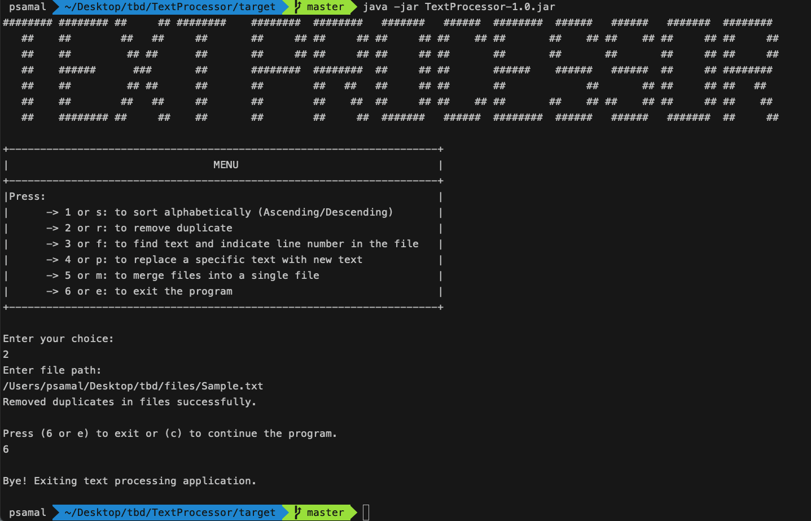

# Text Processor

A command-line menu based tool for manipulating text files, such as sorting lines of text alphabetically and removing duplicate lines.

## Features

- Sort lines of text alphabetically in ascending or descending order.
- Remove duplicate lines from a text file.
- Search for specific text within a file and return the line numbers where it appears.
- Replace a specific text within a file with new text.
- Merge two or more text files into a single file.

## Pre-requisite

1. Java 17 (or higher) should be installed. Run $`java -version` to know the java version
2. Maven 3.9 (or higher) should be installed. Run $`mvn --version` to know the maven version

## Run project

###  Command Line

To run the program locally
1. Create a folder, say MyRepos
2. Move to the folder, run $`cd MyRepos`
3. Clone this repo, run $`git clone https://github.com/samalprasant123/TextProcessor.git`
4. Move to the project root, run $`cd TextProcessor`
5. Create the jar file by running $`mvn install`
6. On BUILD SUCCESS, a target folder will be created. Move to the folder, run  $`cd target`
7. To execute the application, run $`java -jar TextProcessor-1.0.jar`

### IntelliJ IDEA

To create a project in Intellij IDEA
1. Clone the project
2. Import the root as a maven project

